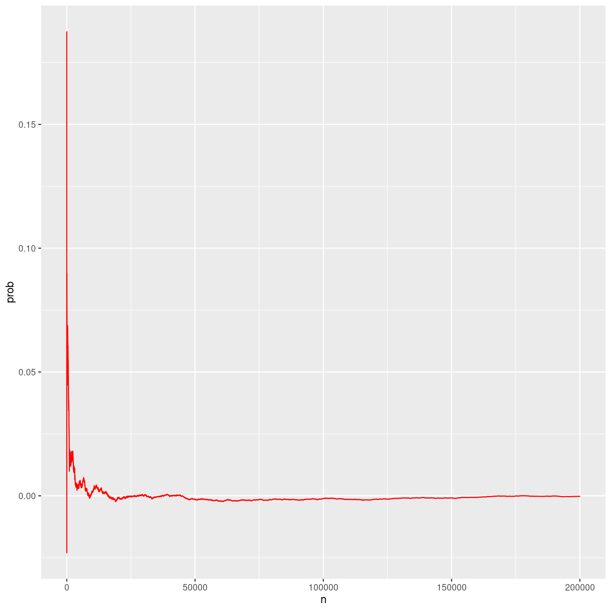
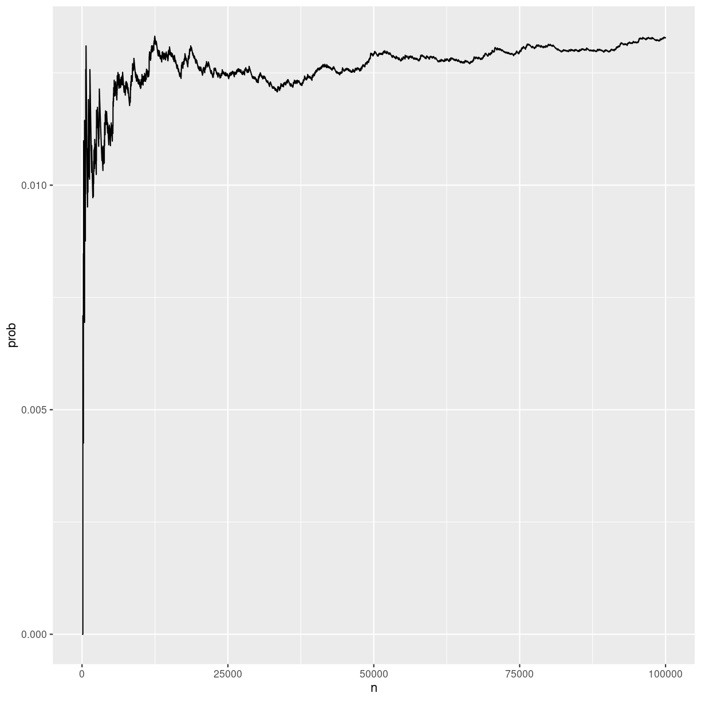

---
# Please do not edit this file directly; it is auto generated.
# Instead, please edit 01-mønt-simulering.md in _episodes_rmd/
title: "Simulering af møntkast"
teaching: 0
exercises: 0
questions:
- "Hvordan simulerer jeg det at kaste med en mønt?"
objectives:
- "At lære at simulere stokastiske processer"
keypoints:
- "Ting der kan være vanskelige at regne ud eksakt, kan ofte simuleres"
---

Generalisering til andet end mønter.

Parallelisering?

### Problemet
Hvis man slår plat-og-krone n gange, hvad er så sandsynligheden for at der *ikke* optræder k kroner i træk?

Det kan man godt regne ud eksakt. Med fire kast, er der 16 mulige resultater. Tre af dem har tre kroner i træk. Det vil sige at der er 13 af de mulige resultater der ikke har. De udgør $\frac{13}{16}$ af de mulige. Sandsynligheden er derfor 0.8125.

Og der er sikkert tricks man kan bruge til at regne det eksakt ud for enhver kombination af n og k. Men det er ikke nødvendigvis let.

I stedet kan man simulere det. Lad computere slå plat og krone n gange, og tjek om der er tre krone i træk. Gør det *mange* gange, tæl og divider, og vi har svaret. Hvis ellers vi gør det tilstrækkeligt mange gange.

~~~
library(tidyverse)
~~~
{: .language-r}

~~~
── Attaching core tidyverse packages ──────────────────────── tidyverse 2.0.0 ──
✔ dplyr     1.1.2     ✔ readr     2.1.4
✔ forcats   1.0.0     ✔ stringr   1.5.0
✔ ggplot2   3.4.2     ✔ tibble    3.2.1
✔ lubridate 1.9.2     ✔ tidyr     1.3.0
✔ purrr     1.0.1     
── Conflicts ────────────────────────────────────────── tidyverse_conflicts() ──
✖ dplyr::filter() masks stats::filter()
✖ dplyr::lag()    masks stats::lag()
ℹ Use the conflicted package (<http://conflicted.r-lib.org/>) to force all conflicts to become errors
~~~
{: .output}

Det er en binomiel sandsynlighedsfordeling, to udfald, med sandsynligheden 0.5 for hver.

Nu kaster vi med mønten 4 gange:

~~~
set.seed(42)
kast <- rbinom(4, 1, .5)
kast
~~~
{: .language-r}

~~~
[1] 1 1 0 1
~~~
{: .output}
der er først 2 1-taller, så 1 0, dernæst 4 1-taller og et 0 etc.

Det er der en funktion der kan tælle for os:

~~~
rle(kast)
~~~
{: .language-r}

~~~
Run Length Encoding
  lengths: int [1:3] 2 1 1
  values : int [1:3] 1 0 1
~~~
{: .output}

Er der et streak på mere end 3 ettaller? Eller, er der 
noget i `r` herunder, hvor lengths er større end (eller lig med)
3. Og values er 1?

~~~
r <- rle(kast)
any(r$lengths[r$values == 1] >= 3)
~~~
{: .language-r}

~~~
[1] FALSE
~~~
{: .output}
Nej, det er der ikke.

Lad os skrive en funktion der svarer på det for vilkårlig længde k. Og vi var altså ude efter at der *ikke* var, så 
vi sætter et ! foran any funktionen:

~~~
no_streak <- function(x, k){
  r <- rle(x)
  !any(r$lengths[r$values == 1] >= k)
}
~~~
{: .language-r}

Så, er der i vores eksempelvektor `kast` ingen streak/run på 3
eller flere?

~~~
kast <- rbinom(4, 1, .5)
kast
~~~
{: .language-r}

~~~
[1] 1 1 1 0
~~~
{: .output}

~~~
no_streak(kast, 3)
~~~
{: .language-r}

~~~
[1] FALSE
~~~
{: .output}

Den er falsk - der er et streak på 3.

Lad os nu lave en funktion, der gentager forsøget r gange,
for en given n (antal kast) og k (det antal kroner vi ikke
vil se i træk). Den lægger alle resultaterne sammen, for 
no_streak funktionen returnerer logiske værdier, og TRUE
tolkes som 1, FALSE som 0. Og så dividerer vi med r. 

Det giver frekvensen af "ingen r gentagne krone" i de r
forsøg:

~~~
no_streak_prob <- function(n,k,r){
  sum(replicate(r, no_streak(rbinom(n, 1, 0.5), k)))/r
}

# n antal kast, 
# k antal gentagelser
# r antal gange vi simulerer
~~~
{: .language-r}

Regner den rigtig?

Ovenfor regnede vi sandsynligheden ud til at være 0.8125

Får vi det? Lad os prøve at køre vores funktion, og bede om
1000 gentagelser:

~~~
no_streak_prob(4, 3, 1000)
~~~
{: .language-r}

~~~
[1] 0.806
~~~
{: .output}
Ikke helt. Hvad hvis vi kører 5000 gange?

~~~
no_streak_prob(4, 3, 5000)
~~~
{: .language-r}

~~~
[1] 0.8056
~~~
{: .output}
Tættere. Hvordan med 50000 gange:

~~~
no_streak_prob(4, 3, 50000)
~~~
{: .language-r}

~~~
[1] 0.81304
~~~
{: .output}
Nu er den ret tæt. Hvad med 100.000 gange?

~~~
no_streak_prob(4, 3, 100000)
~~~
{: .language-r}

~~~
[1] 0.81165
~~~
{: .output}
Ikke meget tættere. Hvad med 200.000 gange?

~~~
no_streak_prob(4, 3, 200000)
~~~
{: .language-r}

~~~
[1] 0.81239
~~~
{: .output}
Endnu tættere. Vi skal nok nå det. Hvor hurtigt går det?

I stedet for at estimere ved 1000 og derefter ved 1001 gentagelser, laver vi 500.000 enkelte forsøg, og kumulerer.

~~~
n <- 4
k <- 3

test <- replicate(200000, no_streak(rbinom(n, 1, 0.5), k))

data <- tibble(svar = test) %>% 
  mutate(n = row_number()) %>% 
  mutate(antal = cumsum(svar)) %>% 
  mutate(prob = antal/n) %>% 
  mutate(distance = prob - 13/16)

p <- data %>% 
  ggplot(aes(n, prob)) +
  #geom_line() +
  geom_line(aes(n,distance), color= "red")
p
~~~
{: .language-r}

plot of chunk unnamed-chunk-14

vi kommer stille og roligt tættere på det korrekte resultat,
jo flere forsøg vi laver. Og vi kan komme arbitrært tæt på,
så længe vi er parate til at vente.

### Generelt

Det var et enkelt eksempel. 

Mere generelt kan vi være interesserede i hvor ofte et bestemt fænomen optræder i en bestemt sammenhæng. Hvordan generaliserer vi det?

Jævnfør ovenstående er der tre trin:

1. Skriv en funktion der genererer sammenhængen. Her er det n kast med en mønt.
2. Skriv en funktion der tjekker om fænomenet optræder. Her om der er en sekvens på 3 krone i kastet med mønt.
3. Lad den første funktion køre X gange. Tjek de X resultater ved hjælp af den anden funktion. Beregn hyppigheden ved at tælle samme hvor ofte vi har succes, og divider med antallet af forsøg. 

Hvis vi tager et spil kort, uden jokere, og trækker tre kort, hvor ofte vil de tre kort være hjerter?

Trin 1:

Vi skal bruge en funktion der generer tre kort fra et spil kort. Vi interesserer os kun for kuløren, så vi kan se bort 
fra værdierne af kortene. Har derfor 13 hjerter, og 39 kort
der ikke er hjerter. 

Vi laver en vektor med 13 H og 39 N (for Non-hjerter)

~~~
bunke <- c(rep("H", 13), rep("N", 39))
~~~
{: .language-r}

Så skriver vi en funktion, der returnerer tre tilfældige kort hver gang vi kører den:

~~~
træk <- function(){
  sample(bunke, 3)
}
  
træk()
~~~
{: .language-r}

~~~
[1] "N" "H" "N"
~~~
{: .output}
Så skal vi bruge en funktion der afgør om vi ser det ønskede,
altså tre kort der alle er hjerter:

~~~
tjek <- function(kort){
  all(kort == "H")
}
~~~
{: .language-r}

Så kører vi vores træk funktion n gange, tjekker resultatet, tæller hvor mange gange der var succes, og dividerer med n:

~~~
n <- 10000
sum(replicate(n, tjek(træk())))/n
~~~
{: .language-r}

~~~
[1] 0.0132
~~~
{: .output}
Og skruer op for n indtil resultatet er ens fra gang til gang.

~~~
test <- replicate(100000, tjek(træk()))

data <- tibble(svar = test) %>% 
  mutate(n = row_number()) %>% 
  mutate(antal = cumsum(svar)) %>% 
  mutate(prob = antal/n) 

data %>% 
  ggplot(aes(n, prob)) +
  geom_line()
~~~
{: .language-r}

plot of chunk unnamed-chunk-19



